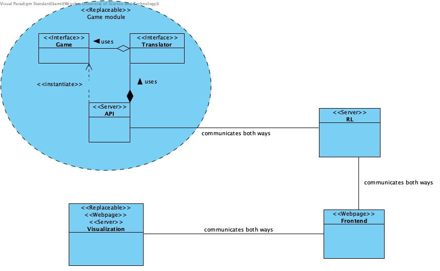
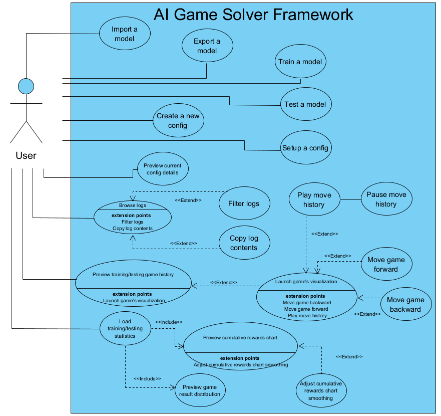
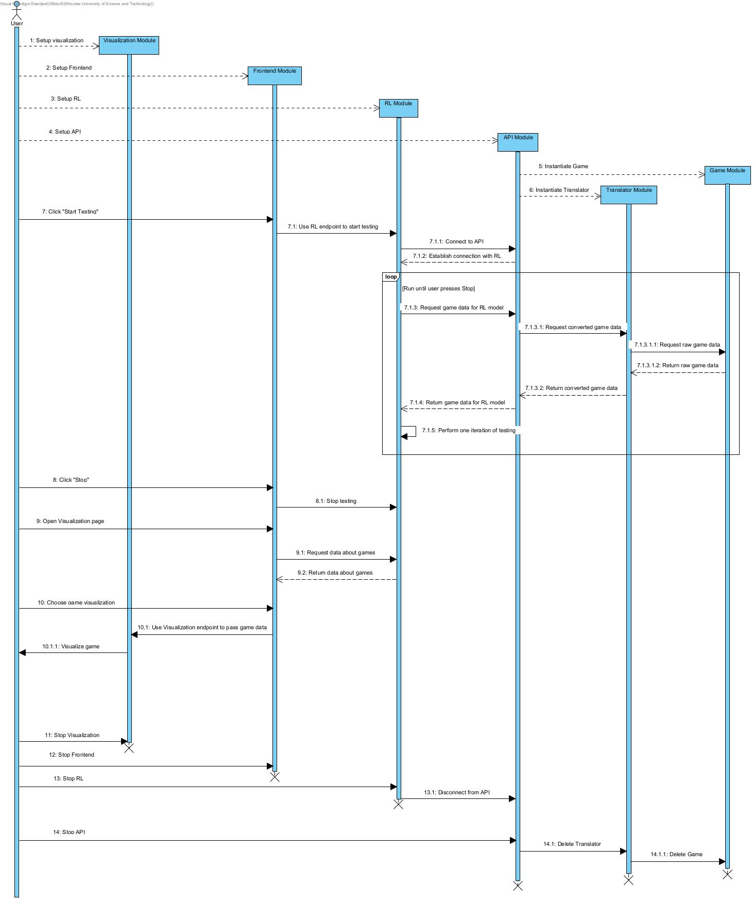
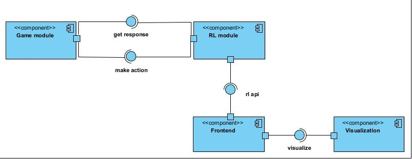

What is the AI Game Solver Framework?
==========================================================================

================================
Functionality of the framework
================================

#. Train and test reinforcement learning model on a given game
#. Import and export the configuration of currently used reinforcement learning model
#. Customise reinforcement learning models by setting the value of the parameters
#. Monitor the training and testing process by seeing logs at current time
#. See statistics of every session
#. See visualization of current game (works only when model is tested)
#. Customise the framework by:

    a. Allowing to connect your own game to the framework
    b. Allowing to implement your own reinforcement learning models
    c. Allowing to connect your own visualization of the game to the framework

============================
Structure of the framework
============================

The framework consists of 4 modules:

#. Game module which consists of:

    a. Game module
    b. Translator module
    c. Api module
#. RL module
#. Frontend module
#. Visualization module (optional)

The structure of the framework and how modules communicate with each other can be seen in the UML diagram below

| Replaceable - an element that can be replaced by the user
| Webpage - a web application that offers a user interface that can be run in a browser
| Server - a server that provides some kind of web interface (http, websocket)
| Interface - an element that has certain methods signatures

=================================
How you can use the framework
=================================

| The user can perform multiple actions within the system.
| The actions that the user can perform can be seen on the UML use case diagram

=======================================
Details of the framework communication
=======================================

| The framework consists of many modules communicating with each other
| The communication of the modules can be seen on the UML sequence diagram below
| In the diagram the user performs the following actions:

#. Sets up all the modules
#. Tests model for some time
#. Sees visualization of one of the games
#. Deactivates all the modules

| NOTE - click on the image if you want to see the diagram more clearly

===================================
Components of the framework
===================================

| The communication between modules can also be seen on the UML component diagram
| The diagram also shows key components of the framework

===================================
Summary
===================================

There are multiple benefits of using the framework. These are:

#. You can only concentrate on implementing the logic of the game because the training process is automated once you setup all the modules
#. It's easy to build new modules and connect them to other modules, thus saving time during implementation
#. You can easily monitor the training process by seeing how the model performs on the game
#. You can easily compare various models by seeing each iteration of training and testing separately
#. You can quickly visualize how the model performs on the game after you implement the Visualization module
#. You can remotely control the training process (e.g., setup Frontend module on one computer and rest of the modules on a different computer)

Unfortunetely the framework has its limitations. These are:

#. Training will take a little bit longer due to the fact that API and RL modules will need to connect with each other
#. Lack of possibiltiy to optimise training for the certain game. Every training needs to follow the same procedure
#. Some algorithms will be very hard to implement in the framework (e.g. depth-first search)
#. It can be difficult to test various modules (especially how they effect other modules)
#. To use the framework you need to have some knowledge about programming and reinforcement learning models

You can't have your cake and eat it. To make some things easier we had to sacrifice potential functionalities.

The framework has a lot of room to improve. In the next updates we will add more tests to each of the modules and improve the existing functionalities.
Our main priority is still trying to make the framework as general as possible and limit as much as possible the number of modules
that the user needs to implement.
