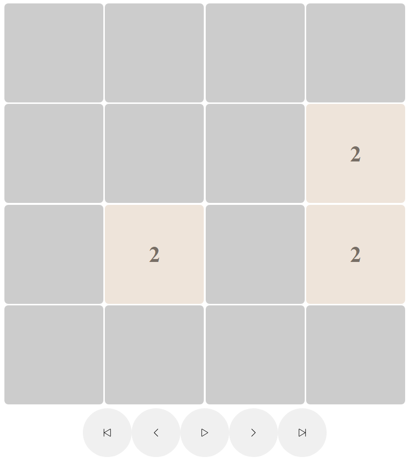

.. _vmd:

Visualization Model Documentation
==================================
---------------------
Description
---------------------

The Visualization Model is designed to provide a visual representation of game. It is a web application that
generates a visualization representation of a game based on the provided data (in our case mainly game boards).

--------------------
Baseline
--------------------
We have provided two complete game module implementations. Both FreeCell and 2048 are equipped with our own visualization modules.
Every visualization needs the following:

* endpoint handling incoming data
* page ready to visualize gathered data, equipped in a frontend of any complexity
* (for games fully bound by Docker) a Dockerfile

--------------------
Dockerfile example
--------------------
Our Dockerfile is shared between both visualizations::

  # Use an official Node.js runtime as a base image
  FROM node:18-alpine

  # Set the working directory inside the container
  WORKDIR /usr/src/app

  # Copy package.json and package-lock.json to the working directory
  COPY package*.json ./

  RUN npm cache clean --force
  # Install project dependencies

  RUN npm install

  # Copy the rest of the application code to the working directory
  COPY . .

  # Expose the port that your Next.js app will run on
  EXPOSE 5005

  # Command to run your Next.js app
  CMD ["npm", "run", "dev"]

-------------------
FreeCell
-------------------
.. _post:

""""""""""""""""""""""""""""""""""""""""""""""""""""""""""""""""""""""
Endpoint for sending data to visualization
""""""""""""""""""""""""""""""""""""""""""""""""""""""""""""""""""""""

   - **URL:** `/api/visualize`
   - **Method:** `POST`
   - **Request JSON Format:** `example for FreeCell game`

     .. code-block:: json

        {
            [
                {
                  "FreeCells": [null, null, null, null],
                  "Stack": [null, null, null, null],
                  "Board": [
                    ["J of h", "8 of s", "5 of d", "Q of h", "9 of c", "K of d"],
                    ["2 of c", "8 of c", "3 of h", "4 of h", "4 of d", "7 of c"],
                    ["Q of s", "8 of h", "2 of h", "3 of s", "6 of s", "A of h"],
                    ["6 of d", "7 of h", "9 of h", "T of s", "J of s", "5 of s"],
                    ["A of s", "T of c", "K of h", "6 of h", "Q of c", "K of s", "K of c"],
                    ["Q of d", "2 of s", "2 of d", "J of c", "A of d", "9 of d", "9 of s"],
                    ["T of h", "A of c", "5 of c", "8 of d", "T of d", "5 of h", "6 of c"],
                    ["4 of s", "J of d", "3 of d", "3 of c", "7 of d", "7 of s", "4 of c"]
                  ]
                },
                {
                  "FreeCells": [null, null, null, null],
                  "Stack": ["A of h", null, null, null],
                  "Board": [
                    ["J of h", "8 of s", "5 of d", "Q of h", "9 of c"],
                    ["2 of c", "8 of c", "3 of h", "4 of h", "4 of d", "7 of c"],
                    ["Q of s", "8 of h", "2 of h", "3 of s", "6 of s"],
                    ["6 of d", "7 of h", "9 of h", "T of s", "J of s", "5 of s"],
                    ["A of s", "T of c", "K of h", "6 of h", "Q of c", "K of s", "K of c"],
                    ["Q of d", "2 of s", "2 of d", "J of c", "A of d", "9 of d", "9 of s"],
                    ["T of h", "A of c", "5 of c", "8 of d", "T of d", "5 of h", "6 of c"],
                    ["4 of s", "J of d", "3 of d", "3 of c", "7 of d", "7 of s", "4 of c"]
                  ]
                },
                                  {
                  "FreeCells": [null, "K of c", null, null],
                  "Stack": ["A of h", null, null, null],
                  "Board": [
                    ["J of h", "8 of s", "5 of d", "Q of h", "9 of c"],
                    ["2 of c", "8 of c", "3 of h", "4 of h", "4 of d", "7 of c"],
                    ["Q of s", "8 of h", "2 of h", "3 of s", "6 of s"],
                    ["6 of d", "7 of h", "9 of h", "T of s", "J of s", "5 of s"],
                    ["A of s", "T of c", "K of h", "6 of h", "Q of c", "K of s"],
                    ["Q of d", "2 of s", "2 of d", "J of c", "A of d", "9 of d", "9 of s"],
                    ["T of h", "A of c", "5 of c", "8 of d", "T of d", "5 of h", "6 of c"],
                    ["4 of s", "J of d", "3 of d", "3 of c", "7 of d", "7 of s", "4 of c"]
                  ]
                }
              ]
        }

    - **Description:** `This endpoint is used to get a list of boards from frontend module`

   - **Response Format:**

     .. code-block:: json

        {
          "url": "/freecell",
          "data": "JSON_DATA",
        }

    - **Description:** As a response GUI should send a url link which leads to visualization page. This link is connected to visual representation of a game - see :ref:`visualization` for more details.

.. _visualization:

""""""""""""""""""""""""""""""""""""""""""""""""""""""""
Visualization page
""""""""""""""""""""""""""""""""""""""""""""""""""""""""
   - **URL:** `/freecell`
   - **Method:** `GET`
   - **Response Format:** `HTML`
   - **Description:** This url provides a visual representation of posted data, and should be sent as `url` parameter in a response to POST request to :ref:`post`.
   - **Customization:** This url can and should be modified for a specific game, this is only an example.

""""""""""""""""""""""""""""""""""""""""""""""""""""""""
End result
""""""""""""""""""""""""""""""""""""""""""""""""""""""""
Our visualization is very simple. While it does not allow performing moves on a loaded game, users may move between the board states forwards and backwards or watch entire game unveil, using Play/Pause button.
Additionally, the last move is indicated by grey cards - opaque one is the new slot of the moved card, while transparent indicates its previous position.
To checkout entire repository, visit `our FreeCell visualization repository <https://github.com/ZPI-2023-IST/FreeCell-GUI>`_.

-------------------
2048
-------------------
.. _post2048:

""""""""""""""""""""""""""""""""""""""""""""""""""""""""""""""""""""""
Endpoint for sending data to visualization
""""""""""""""""""""""""""""""""""""""""""""""""""""""""""""""""""""""

   - **URL:** `/api/visualize`
   - **Method:** `POST`
   - **Request JSON Format:** `example for 2048 game`

     .. code-block:: json

        [
          [
            [2, 0, 0, 0],
            [0, 0, 4, 0],
            [0, 0, 0, 0],
            [0, 0, 0, 0]
          ],
          [
            [2, 0, 0, 0],
            [4, 0, 0, 0],
            [0, 0, 2, 0],
            [0, 0, 0, 0]
          ],
          [
            [2, 0, 2, 0],
            [4, 0, 0, 0],
            [0, 2, 0, 0],
            [0, 0, 0, 0]
          ],
          [
            [4, 0, 0, 0],
            [4, 0, 0, 0],
            [2, 0, 0, 0],
            [0, 0, 0, 2]
          ]
        ]

    - **Description:** `This endpoint is used to pass a respective board states throughout the game from frontend module`

   - **Response Format:**

     .. code-block:: json

        {
          "url": "/2048"
        }

    - **Description:** As a response GUI should send a url link which leads to visualization page. This link is connected to visual representation of a game - see :ref:`visualization2048` for more details.

.. _visualization2048:

""""""""""""""""""""""""""""""""""""""""""""""""""""""""
Visualization page
""""""""""""""""""""""""""""""""""""""""""""""""""""""""
   - **URL:** `/2048`
   - **Method:** `GET`
   - **Response Format:** `HTML`
   - **Description:** This url provides a visual representation of posted data, and should be sent as `url` parameter in a response to POST request to :ref:`post2048`.
   - **Customization:** This url can and should be modified for a specific game, this is only an example.

""""""""""""""""""""""""""""""""""""""""""""""""""""""""
End result
""""""""""""""""""""""""""""""""""""""""""""""""""""""""
Our visualization is very simple. While it does not allow performing moves on a loaded game, users may move between the board states forwards and backwards, skip to the end, revert to the start or watch entire game unveil, using Play/Pause button.
To checkout entire repository, visit `our 2048 visualization repository <https://github.com/ZPI-2023-IST/2048-Vis>`_.

