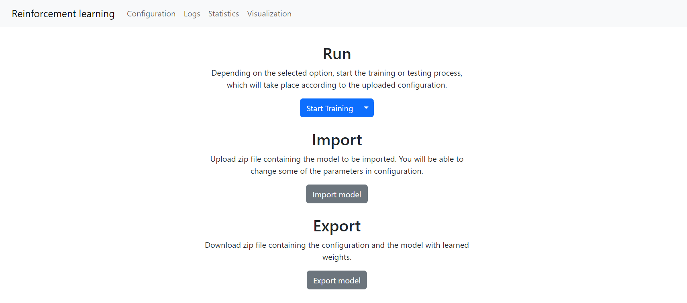

How to use the module
===============================

=================
Prerequisites
=================

| This module assumes that you've properly configured and started all the modules
| If not please refer to this tutorial TO DO

===================================================
Framework usage (example on FreeCell game)
===================================================

If you have configured everything correctly you'll need to:

1. Open the browser
2. Type localhost:3000

You should see the following screen

If you see any errors restart all the modules and try again.

