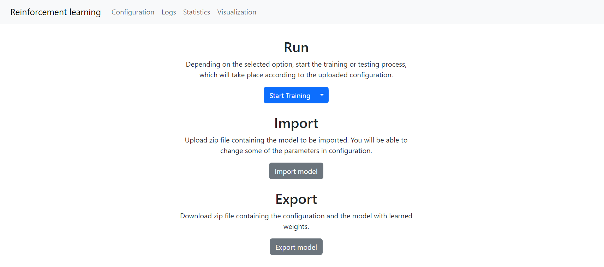
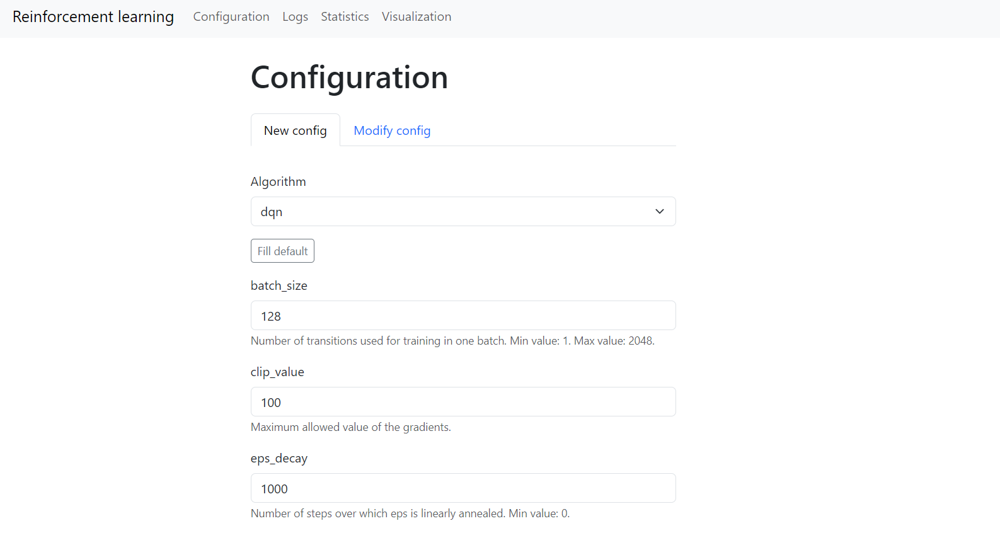
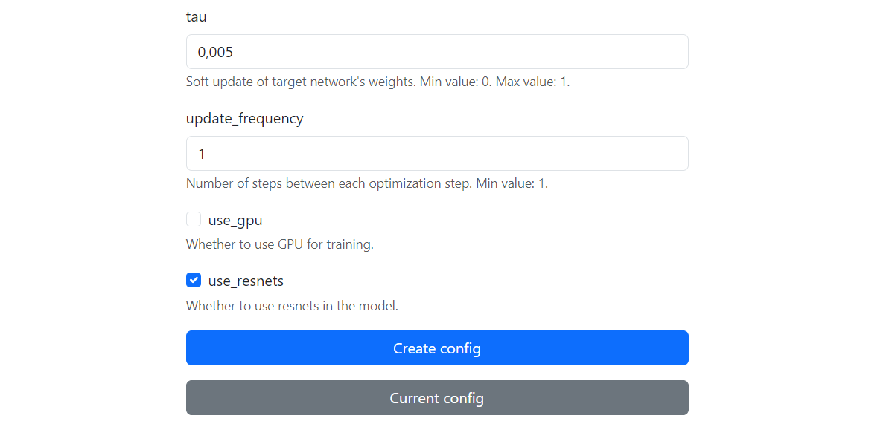
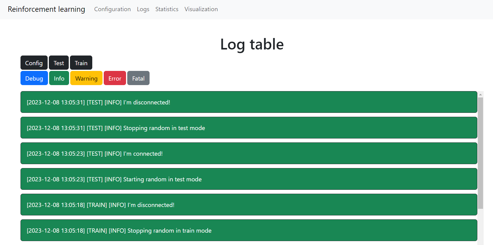
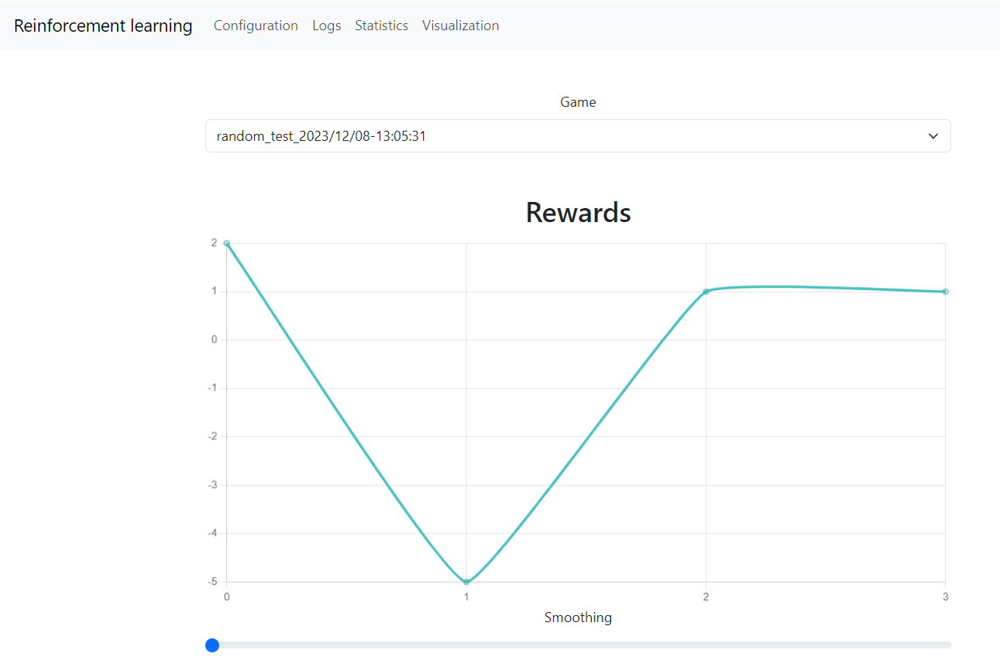
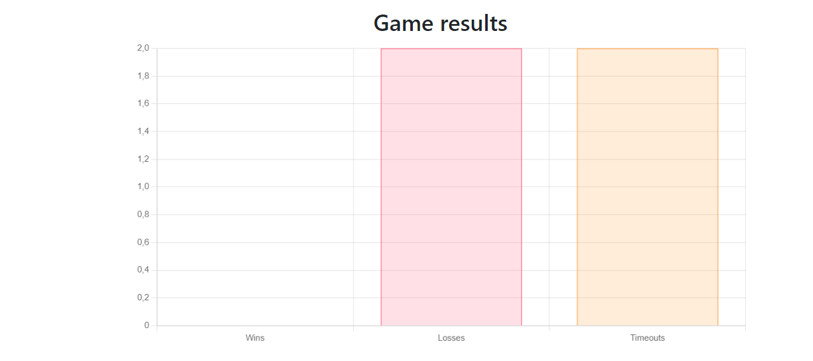
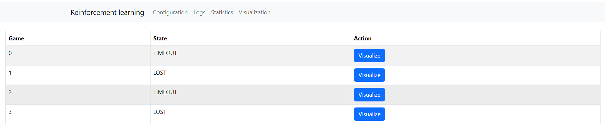
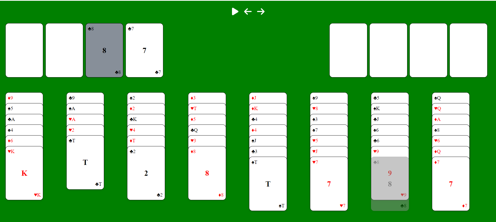

How to use the module
===============================

=================
Prerequisites
=================

| This module assumes that you've properly configured and started all the modules
| If not please refer to :doc:`how to setup the framework tutorial <setup>` 

===================================================
Framework usage
===================================================

If you have configured everything correctly you'll need to:

1. Open the browser
2. Type localhost:3000

You should see the following screen

If you see any errors restart all the modules and try again.

--------------------------------------
Main page
--------------------------------------

On the main page you can:

#. Start training/testing the model on the game
#. Import model from the zip file
#. Export current model to the zip file

NOTE - training reinforcement learning models is a very time consuming task. 
We recommend to train models for at least several hours (in case of Freecell/2048 with default model parameters training took around 24 hours).
Please be aware that training times may vary a lot. We recommend that you check logs and statistics sporadically to see how the model is performing.

--------------------------------------
Configuration
--------------------------------------

On the configuration page you can:

#. Create new model by choosing algorithm and setting the values of all available parameters
#. Modify current model by setting the values of all available parameters

| The list of available parameters is dependent on the model you've chosen
| NOTE - some parameters may not be possible to modify after training has started
| If you've misconfigured the model and did not start training we recommend that you create a new model from scratch

--------------------------------------
Logs
--------------------------------------

On the logs page you can:

#. See all the logs from the current session
#. Filter logs based on given conditions

--------------------------------------
Statistics
--------------------------------------

On the statistics page you can:

#. See how the reward has changed throughout the training/testing. You can smoothen the results
#. See the number of won/lost games by the model. You can also see the number of games that did not finish due to the timeout

----------------------------------------------------------------------------
Visualization (on the example of FreeCell game)
----------------------------------------------------------------------------

On the visualization page you can:

#. See how the model performed on each game by seeing the visualization of all the moves made by the model

NOTE - visualization page redirects to visualization module. If visualization module is not running that this page won't work.
