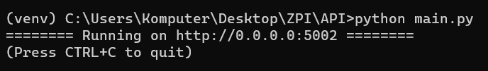
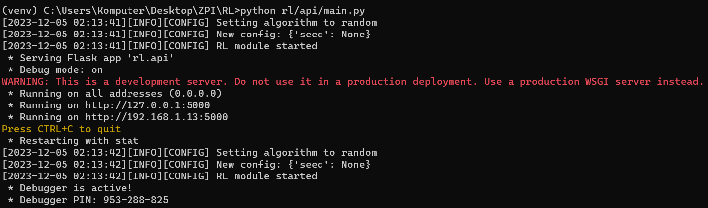
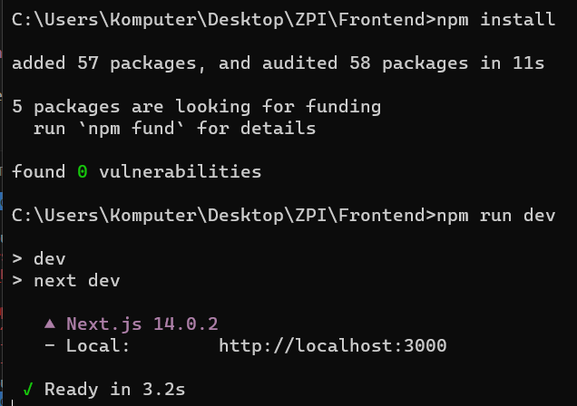
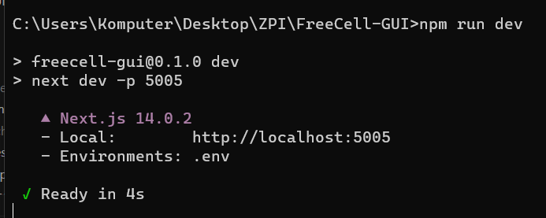
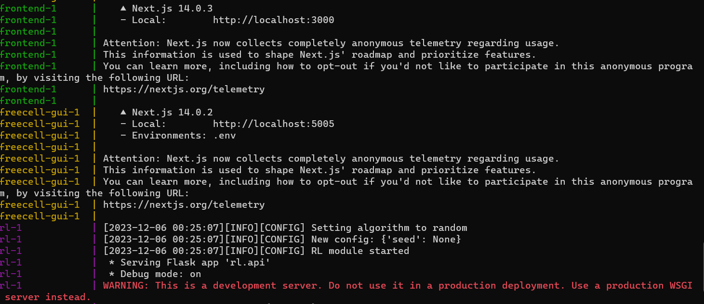

How to setup the framework
==============================================

=================
Prerequisites
=================

To run the program you need the following software installed:

1. `git <https://git-scm.com/book/en/v2/Getting-Started-Installing-Git/>`_
2. `Python 3.10 <https://www.python.org/downloads/release/python-31011/>`_
3. `Node.js <https://docs.npmjs.com/downloading-and-installing-node-js-and-npm/>`_
4. `Docker Compose <https://docs.docker.com/compose/install/>`_ (optional)

================================
Setup
================================

There are two possible ways to setup the framework:

1. Manually setting up the whole framework
2. Using Docker Compose to automatically setup the whole framework

| In this tutorial we will setup the framework to train models on `FreeCell <https://github.com/ZPI-2023-IST/FreeCell/>`_.
| The installment for other games will look similar but there may be slight differences so please read README files before you proceed

--------------------------------------
Setup (manual)
--------------------------------------

To manually setup the whole framework you'll need to setup these modules:

1. API
2. RL
3. Frontend
4. Visualisation (optional)

After setting up all the modules you will be able to run the framework any time

^^^^^^^^^^^^^^^^^^^^^^^^^^^^^^^^^^^^^^
API setup
^^^^^^^^^^^^^^^^^^^^^^^^^^^^^^^^^^^^^^

To setup API you'll need to perform the following steps:

1. open terminal
2. git clone https://github.com/ZPI-2023-IST/API
3. cd API
4. `create venv and activate it <https://docs.python.org/3.10/library/venv.html/>`_
5. pip install -r requirements.txt
6. pip install git+https://github.com/ZPI-2023-IST/FreeCell.git (installing game)
7. pip install git+https://github.com/ZPI-2023-IST/Translator.git (installing translator)

After performing all the steps run **python main.py** in the terminal. You should see the following screen

If you see an error please try again from the start. If that doesn't solve the issue please contact us.

^^^^^^^^^^^^^^^^^^^^^^^^^^^^^^^^^^^^^^
RL setup
^^^^^^^^^^^^^^^^^^^^^^^^^^^^^^^^^^^^^^

To setup RL you'll need to perform the following steps:

1. open terminal
2. git clone https://github.com/ZPI-2023-IST/RL
3. cd RL
4. `create venv and activate it <https://docs.python.org/3.10/library/venv.html/>`_
5. pip install -e .

NOTE - to run the rl module locally you'll need to change host (TO DO AFTER PATRYK FINISHES)

After performing all the steps run **python rl/api/main.py** in the terminal. You should see the following screen

If you see an error please try again from the start. If that doesn't solve the issue please contact us.

^^^^^^^^^^^^^^^^^^^^^^^^^^^^^^^^^^^^^^
Frontend setup
^^^^^^^^^^^^^^^^^^^^^^^^^^^^^^^^^^^^^^

To setup Frontend you'll need to perform the following steps:

1. open terminal
2. git clone https://github.com/ZPI-2023-IST/Frontend
3. cd Frontend
4. npm install

After performing all the steps run **npm run dev** in the terminal. You should see the following screen

| If you see an error please try again from the start. If that doesn't solve the issue please contact us.
| NOTE - do not click on the link unless you have API and RL modules running

^^^^^^^^^^^^^^^^^^^^^^^^^^^^^^^^^^^^^^
Visualisation setup
^^^^^^^^^^^^^^^^^^^^^^^^^^^^^^^^^^^^^^

To setup Visualisation you'll need to perform the following steps:

1. open terminal
2. git clone https://github.com/ZPI-2023-IST/FreeCell-GUI
3. cd FreeCell-GUI
4. npm install

After performing all the steps run **npm run dev** in the terminal. You should see the following screen

| If you see an error please try again from the start. If that doesn't solve the issue please contact us.
| NOTE - the module should be accessible from Frontend. On itself it won't run

--------------------------------------
Setup (Docker Compose)
--------------------------------------

| To make setup easier you can use Docker Compose
| For that to be able to run you'll need to have every module configured to run as a Docker container
| We've shared a script for Docker Compose setup
| To setup the module in this way you need to perform the following steps:

1. open terminal
2. git clone https://github.com/ZPI-2023-IST/Containers
3. cd Containers
4. git checkout Z2-85_docker_compose
5. docker compose up

After performing all the steps you should see the following screen

If you see an error please try again from the start. If that doesn't solve the issue please contact us.
